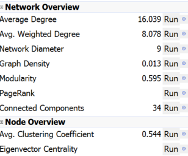

# Graph Analytics

### by Federico Bozzini
------------------------

## The Data

The graph I decided to study is the network of the researchers working at the Istituto Italiano di Tecnologia (IIT). The vertices of the graph are the IIT researchers and the edges are the collaborations among the researchers.

The dataset I used are the list of researchers of the IIT (file *researchers.json*) and the documents (publications, books, ...) published with an IIT affiliation.

I was able to match the two datasets by using the surnames the researchers and the list of authors of the documents. For instance with three researchers 'Manna', 'Prato' and 'Nori' and a document with an authors list like 'Manna L., Braida L., Prato M.', a link between 'Manna' and 'Prato' is created, while 'Nori' isn't.

The alghoritm presented before suffers from several imprecisions (researchers with the same name, omonimy in the author list), but the result I got were pretty good anyway, so it can be considered a good start.

The total number of vertices is 667. The total number of edges is 5349.

## The graph analysis (ex 1)

I converted the data from the two initial datasets to an adjacency matrix by using a Python script (*create_adjacency_matrix.py*) that stores the result in different formats (CSV, json).

I used the CSV with Gephy to analyse the data:

The highest degree for all the vertices is 62, the lowest is 1, the average degree is 16.039;

The network diameter is 9.

The modularity is 0.595.

The number of Weakly Connected Components is 34.
The number of Stronlgy Connected Components is 59.

The average clustering coefficient is 0.544.

The graph is, generally speaking, very strongly connected.

## The Attack (ex 3)

After trying the library networkx with some toy data I tried the library also on my graph. I found the library very powerful in the graph measurement calculations but a bit lacking in the graph drawing, so I decided to write the attack simulation with *javascript* using the *d3* library, rewriting the necessary algorithm for the graph measurements (*degree*, *clustering coefficient*,*giant component research*, ...) by myself.

To run the web application the command is:

    python -m SimpleHTTPServer

The attack is simulated by displaying the graph on an html page, with some possibility to interact with the graph. It's possible to remove a node by clicking on it and it's possible to start an automated attack. With the latter option, every unit of time a node is selected (by degree, clustering coefficient or simply at random) and removed and the graph is updated.

Some statistics about the graph are shown, like the size of the giant component and are updated at each unit of time.

### The results

My graph was highly connected with several large and small communities. When removing the vertices by clustering coefficient the graph was completely resistant to failures, when the vertices were instead removed by degree the graph was a bit more sensitive but still not very prone to failures. The Giant component remained very big until more than half of the nodes were removed.

The graph feautures also a high level of degree correlation and can be clearly described as an assortative network.

## Contagion (ex 4)

To start a contagion in the application the user may select a few parameters: the amount of vertices initially infected, the payoff matrix and the random selection criteria.

Once the contagion has started the vertices change their state according to the behavior of their neighors.

### The results

When the highest degree vertices were selected the probabily to spread the infection were very high, even when using a low number o nodes and a balanced payoff matrix. This confirms the assortativity of the network.